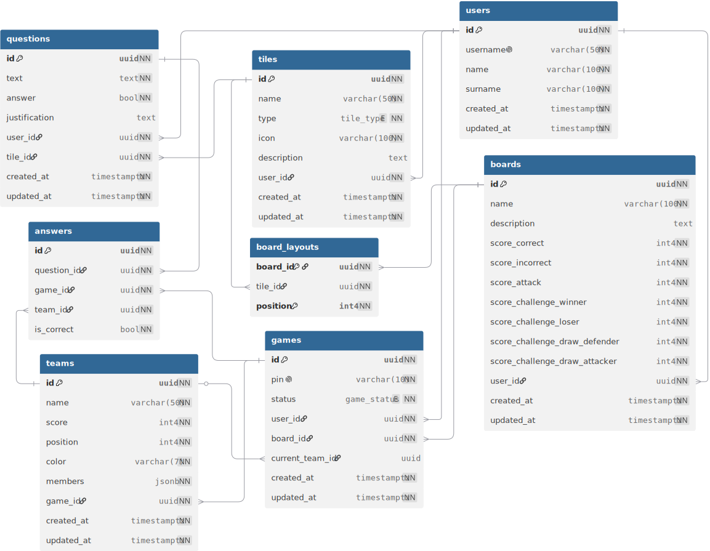

<div align="center">
  

---
  **Plataforma web para la creación y gestión de juegos de mesa educativos personalizados.**

  Tabledu permite a los profesores transformar el contenido de sus asignaturas en experiencias de juego interactivas, configurando tableros, categorías, preguntas y partidas desde un panel propio.

  [](https://tabledu.com)
  [](./LICENSE)

</div>

---

## Índice

1. [Contexto](#1-contexto)
2. [Stack tecnológico](#2-stack-tecnológico)
3. [Estructura del proyecto](#3-estructura-del-proyecto)
4. [Modelo de datos](#4-modelo-de-datos)
5. [Configuración local](#5-configuración-local)
6. [Documentación](#6-documentación)

---

## 1. Contexto

Tabledu nace como evolución de **Cyberpatrol**, un juego educativo basado en el juego de la oca diseñado originalmente por Clara Ayora Esteras y José Luis de la Vara González (UCLM) y utilizado en la asignatura de Sistemas de Información del Grado en Ingeniería Informática. El objetivo no es digitalizar ese juego concreto, sino construir una **plataforma genérica** en la que cualquier profesor pueda crear y gestionar sus propios tableros y partidas.

El proyecto se desarrolla como Trabajo Fin de Grado en la [Escuela Superior de Ingeniería Informática de Albacete (UCLM)](https://esiiab.uclm.es), bajo la supervisión de Clara Ayora Esteras y José Luis de la Vara González.

---

## 2. Stack tecnológico

| Capa | Tecnología |
| :--- | :--- |
| Frontend | React 19 + Vite 7 (SPA) |
| Estilos | Tailwind CSS + shadcn/ui |
| Backend & Auth | Supabase (PostgreSQL + Auth + RLS) |
| Gestor de paquetes | pnpm |
| Deploy | Vercel |

---

## 3. Estructura del proyecto

```text
tabledu/
├── src/
│   ├── components/        # Componentes globales reutilizables
│   ├── features/          # Módulos por feature (auth, boards, games…)
│   ├── hooks/             # Hooks globales
│   ├── layouts/           # Layouts de página
│   ├── lib/               # Configuración de librerías (Supabase, utils)
│   ├── router/            # Definición de rutas y guards
│   ├── services/          # Capa de acceso a datos (Supabase)
│   └── utils/             # Utilidades generales
├── public/                # Assets estáticos
├── docs/                  # Documentación y diagramas
│   └── database/          # Scripts SQL de creación del esquema
├── .env.example           # Variables de entorno necesarias
└── index.html
```

La arquitectura de `src/` sigue una organización por features. Consulta [ARCHITECTURE.md](./ARCHITECTURE.md) para las convenciones detalladas.

---

## 4. Modelo de datos

<div align="center">
  
</div>

Las entidades principales son: `users`, `boards`, `categories`, `questions`, `board_category`, `games`, `teams` y `answers`. Los scripts de creación del esquema están disponibles en [`docs/database/`](./docs/database/).

---

## 5. Configuración local

**Requisitos previos:** Node.js 20+, pnpm, cuenta en [Supabase](https://supabase.com).

```bash
# 1. Clonar el repositorio
git clone https://github.com/alejo9am/tabledu.git
cd tabledu

# 2. Instalar dependencias
pnpm install

# 3. Configurar variables de entorno
cp .env.example .env
# Editar .env con tus credenciales de Supabase

# 4. Iniciar el servidor de desarrollo
pnpm dev
```

Las variables de entorno necesarias están documentadas en `.env.example`:

```bash
VITE_SUPABASE_URL=
VITE_SUPABASE_PUBLISHABLE_DEFAULT_KEY=
```

---

## 6. Documentación

| Documento | Descripción |
| :--- | :--- |
| [ARCHITECTURE.md](./ARCHITECTURE.md) | Convenciones de estructura y organización del código frontend |
| [DESIGN.md](./DESIGN.md) | Sistema de diseño: marca, tipografía, color e iconografía |
| [docs/database/](./docs/database/) | Scripts SQL del esquema de base de datos |
